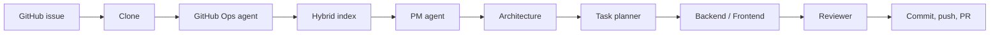

# CoCoder

**Autonomous coding agents for GitHub issues.**

CoCoder watches a repository, picks up an issue, and runs a multi-agent pipeline until there is a pull request you can review — with every stage streamed live in the dashboard.

> Close issues. Not tabs on a feed.

---

## Why this exists

Issue trackers fill up faster than people can context-switch. The usual “AI coding” loop still dumps you in a chat: paste the issue, paste files, hope the model remembers the repo, then copy a patch back by hand.

CoCoder is built for the other loop:

1. The issue already lives on GitHub.
2. The agent should **read the codebase**, not a pasted snippet.
3. The work should be **visible** — plan, edits, review, PR — not a black box.
4. You should bring **your own keys** and stay on your machine.

It is closer to an on-call teammate than a chat window.

## What it does

- **Connects GitHub** with a personal access token or OAuth
- **Indexes** the repo with a hybrid retrieval stack (embeddings + AST + dependency graph)
- **Runs a specialist crew** on each issue: GitHub Ops → PM → architecture → task planner → backend/frontend → reviewer
- **Opens a PR** on `{type}/{issue-number}-{title-slug}` (for example `fix/42-login-crash`) that references `Fixes #<n>` or `Closes #<n>`
- **Streams the run** over a websocket so you can watch stages, diffs, and agent output as they happen
- **BYOK** for OpenAI, Anthropic, Google, OpenRouter, or a custom OpenAI-compatible(Ollama etc.) endpoint (keys stored encrypted, never returned in full)

## How a run works



| Stage | What happens |
| --- | --- |
| Clone | Updates the workspace |
| GitHub Ops | Classifies the issue from labels (or title/body) and checks out `{type}/{n}-{slug}` |
| Index | RAG + tree-sitter AST + import graph, then retrieves a context pack for the issue |
| PM | Turns the issue into a goal and acceptance criteria |
| Architecture | Maps which files and layers should change |
| Planner | Splits work into backend/frontend tasks |
| Develop | Agents edit the workspace with file tools |
| Review | Approves or sends work back (up to `MAX_REVIEW_RETRIES`) |
| GitHub Ops (PR) | Commits, pushes, opens the pull request |

Locally, GitHub cannot reach `localhost`. Use **Sync open issues** in the UI, or expose the API with a tunnel and register a webhook (see below).

## Quick start

**You need:** Python **3.13+**, [uv](https://docs.astral.sh/uv/), Node.js **20+**, and Git.

| | Linux / macOS | Windows |
| --- | --- | --- |
| Python | [python.org](https://www.python.org/downloads/) or your package manager | [python.org](https://www.python.org/downloads/) — tick **Add python.exe to PATH** |
| uv | `curl -LsSf https://astral.sh/uv/install.sh \| sh` | `powershell -ExecutionPolicy Bypass -c "irm https://astral.sh/uv/install.ps1 \| iex"` |
| Node | [nodejs.org](https://nodejs.org/) or `nvm` | [nodejs.org](https://nodejs.org/) or `nvm-windows` |
| Git | `git` from your package manager | [Git for Windows](https://git-scm.com/download/win) (includes Git Bash) |

Use **two terminals**: one for the API, one for the dashboard. On Windows, PowerShell or Git Bash both work; commands below are PowerShell unless noted.

### 1. API

**Linux / macOS**

```bash
cd server
cp .env.example .env
# set at least OPENROUTER_API_KEY (or another provider later in Settings)
# optional: GITHUB_TOKEN as a server-wide fallback
uv sync
uv run python main.py
```

**Windows (PowerShell)**

```powershell
cd server
Copy-Item .env.example .env
# set at least OPENROUTER_API_KEY (or another provider later in Settings)
# optional: GITHUB_TOKEN as a server-wide fallback
uv sync
uv run python main.py
```

Edit `.env` in any text editor. API: [http://localhost:8000](http://localhost:8000) · health: [http://localhost:8000/health](http://localhost:8000/health)

### 2. Dashboard

Same on both platforms (`npm` is identical once Node is on your `PATH`):

```bash
cd frontend
npm install
npm run dev
```

UI: [http://localhost:5173](http://localhost:5173)

Point the UI at another API with `VITE_API_BASE` (Linux/macOS: `export VITE_API_BASE=...`; Windows PowerShell: `$env:VITE_API_BASE="..."`).

### 3. First session

1. Sign up at `/signup`.
2. **Settings → GitHub** — paste a PAT with `repo` scope, or connect OAuth (`GITHUB_OAUTH_CLIENT_ID` / `SECRET` in `.env`).
3. **Settings → LLM** — save a provider key and pick a model. OpenRouter is the default env fallback (`LLM_MODEL`).
4. **Repositories** — register `owner/name`.
5. Open the repo → **Sync open issues**, or run a specific issue number.
6. Watch the run at `/runs/:id`.

## Configuration

Copy [`server/.env.example`](server/.env.example). Important variables:

| Variable | Purpose |
| --- | --- |
| `OPENROUTER_API_KEY` | Default model provider if the user has not saved BYOK |
| `LLM_MODEL` | Default model id (e.g. `deepseek/deepseek-v4-flash`) |
| `GITHUB_TOKEN` | Optional server fallback when a user has no PAT/OAuth |
| `GITHUB_WEBHOOK_SECRET` | HMAC secret for `POST /webhooks/github` |
| `GITHUB_OAUTH_CLIENT_ID` / `SECRET` | GitHub OAuth app for “Connect GitHub” |
| `GITHUB_OAUTH_REDIRECT_URI` | Must match the OAuth app callback |
| `FRONTEND_URL` | Where OAuth redirects after connect |
| `CORS_ORIGINS` | Comma-separated dashboard origins |
| `AUTH_COOKIE_SECURE` | Set `true` behind HTTPS |
| `COCODER_SECRETS_KEY` | Fernet key for encrypted secrets; auto-created if unset |

SQLite, workspaces, and the index live under `server/.cocoder/` and `server/workspace/` (gitignored).

### GitHub webhook (optional)

GitHub cannot POST to `http://localhost:8000` until you tunnel it.

1. Install [ngrok](https://ngrok.com/download) (or Cloudflare Tunnel) for your OS, then run `ngrok http 8000` — copy the HTTPS URL  
2. Repo → **Settings → Webhooks → Add webhook**  
3. Payload URL: `https://<tunnel>/webhooks/github`  
4. Content type: `application/json`  
5. Secret: same as `GITHUB_WEBHOOK_SECRET` (leave both empty only for unsigned local tests)  
6. Events: **Issues** (opened / reopened)

Without a tunnel, sync from the dashboard or:

**Linux / macOS**

```bash
curl -X POST http://localhost:8000/repos/<repo_id>/issues/sync
```

**Windows (PowerShell)**

```powershell
Invoke-RestMethod -Method POST -Uri http://localhost:8000/repos/<repo_id>/issues/sync
```

On Windows 10+, `curl.exe -X POST http://localhost:8000/repos/<repo_id>/issues/sync` also works (`curl` without `.exe` in PowerShell is often an alias for `Invoke-WebRequest`).

## Architecture

```
CoCoder/
├── frontend/     Vite + React dashboard (runs, repos, live events, settings)
└── server/       FastAPI API
    ├── agents/         PM, architecture, planner, backend, frontend, reviewer
    ├── orchestrator/   Pipeline + background runner
    ├── indexing/       Hybrid RAG / AST / dependency graph
    ├── tools/          Git, GitHub issues/PRs, filesystem tools
    ├── api/            Auth, repos, runs, settings, webhooks
    └── secure_store/   Encrypted BYOK + GitHub credentials
```

Each CoCoder account owns the repos it registers (`owner/name` is unique in the database). A GitHub token can reach every repo GitHub allows; **runs stay on the CoCoder user who connected that repo**.

## Security notes

- Session auth is cookie-based; do not expose the API without TLS in production (`AUTH_COOKIE_SECURE=true`).
- Model and GitHub secrets are encrypted at rest. API responses return masks, never full keys.
- The agent clones into a local workspace and can push with the stored token. Use a token you are willing to grant `repo` access.

## Status

v0.1 — usable as a local dashboard and pipeline. Expect sharp edges: one owner per GitHub repo in CoCoder, SQLite by default, and webhooks need a public URL.

## Docs in-tree

- [`server/README.md`](server/README.md) — API endpoints  
- [`frontend/README.md`](frontend/README.md) — dashboard dev server  
